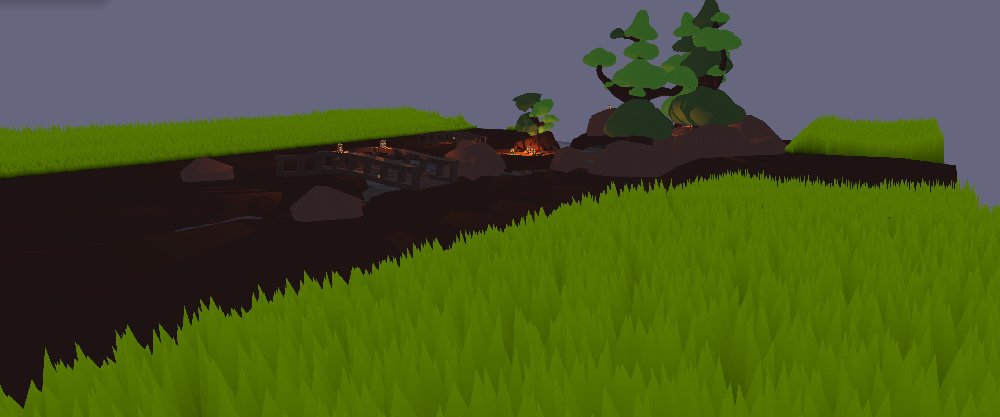

# 
[](https://crates.io/crates/warbler_grass)
[](https://docs.rs/warbler_grass/0.4/warbler_grass/)

A `bevy` plugin for ergonomic integration of grass in 3d games.

Currently, bevy version `0.10` is supported.
Wasm builds are also supported!

**Don't use this project for serious projects, it is still under heavy development. 
Currently, the project is not ready to be used besides side projects or for learning purposes**



The preview image comes from [my demo project](https://github.com/EmiOnGit/birdylook) where I use this crate for grass rending

Another cool project using this crate is the [foxtrot](https://github.com/janhohenheim/foxtrot) template. Check it out!
## Usage
Add `warbler_grass` as dependency to your project
```toml
[dependencies]
warbler_grass = "0.4"
```
### Add grass to your game:
```rust

use bevy::{prelude::*, render::primitives::Aabb};
use warbler_grass::prelude::*;
mod helper;

fn main() {
    App::new()
        .add_plugins(DefaultPlugins)
        // This plugin is needed to initialize everything for the grass render pipeline
        .add_plugin(WarblersPlugin)
        .add_startup_system(setup_grass)
        .run();
}
fn setup_grass(mut commands: Commands, asset_server: Res<AssetServer>) {
    // Loading the height map from an image
    let y_map_image = asset_server.load("grass_y_map.png");
    // Constructing the height map struct
    let y_map = YMap { height_map };

    // Loading the density map from an image
    let density_map = asset_server.load("grass_density_map.png");
    // Constructing the density map
    let density_map = DensityMap {
        density_map,
        // The density corresponds to how dense a dense area is supposed to be.
        // Be careful with this parameter since the blade count grows fast. 
        density: 2.,
    };
    commands.spawn(WarblersBundle {
        y_map,
        density_map,
        // The height of the blades
        height: WarblerHeight::Uniform(2.),
         // The aabb defines the area in which the chunk lives in
        aabb: Aabb::from_min_max(Vec3::ZERO, Vec3::new(100., 10., 100.)),
        ..default()
    });
}

```
You can also use the editor to modify the maps in your game
Take a look at the `editor` example on how this might work

## Examples
You can find them in the [`example folder`](https://github.com/EmiOnGit/warbler_grass/tree/master/examples)


### Load grass
The basic example. If you just want to take a look how using this crate might look like, look no further
```shell
cargo run --example load_grass
```
### Editor
A simple editor to modify and save the maps such as the density map of the grass
Note that you also need the editor feature of this crate, which is not enabled by default
```shell
cargo run --example editor --features="editor"
```
### Grass colors
You don't like the default grass color or you game has multiple seasons? 
Take a look how you can change the color of the grass
```shell
cargo run --example grass_colors
```

### Grass mesh
You don't like the default mesh of the grass? Don't worry you can use swap the mesh easily.
Note that you can press `TAB` to change the mesh in the demo
```shell
cargo run --example grass_mesh
```
### Many chunks
You'd like to see what this crate can do? Run this demo to see many chunks loaded at once.
This example is also great to demonstrate the frustum culling of the meshes
```shell
# I'd run this demo in release mode first to see how your hardware can keep up
cargo run -r --example many_chunks
```
### Stress test
This is not much of a example. It is used to limit test the crate.
Of course you can also load it and see what happens.
```shell
# I'd run this demo in release mode first to see how your hardware can keep up
cargo run -r --example stress_test
```

## Contributing
If you read this part, you might consider helping this project grow.
I consider this project very beginner friendly. 
It is relatively easy to grasp the workings since the use case is clear; to draw grass efficiently.
Don't fear if you are a beginner in bevy or even rust!

Currently, the code can be optimized in many places and many features I'd like to have been partially or completely missing.
You can always just create an issue and ask if something you want to do is needed.
